# Test Summary

This document summarizes the verification steps executed on the MOCA database layer and supporting scripts. The focus was on schema creation, object compilation, data manipulation, and runtime monitoring evidence. Each subsection references a visual artifact captured during testing.

## 1. Schema and Object Creation

- Tables created successfully
  - Evidence: 
- Indexes created to support query performance
  - Evidence: 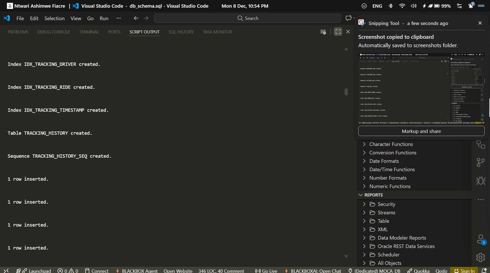
- Sequences initialized for primary keys and business IDs
  - Evidence: 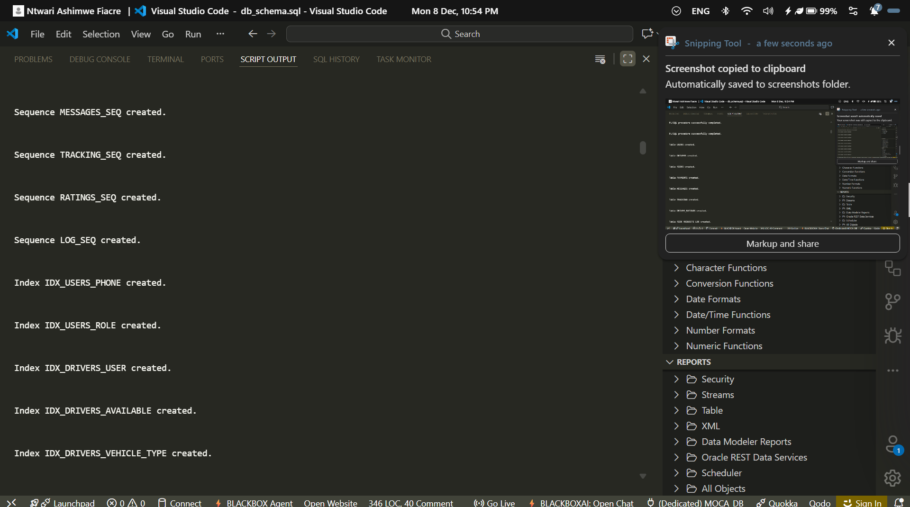

## 2. Program Units Compilation
- Packages compiled without errors
  - Evidence: 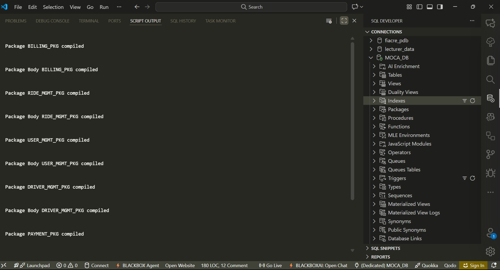
  - Evidence: 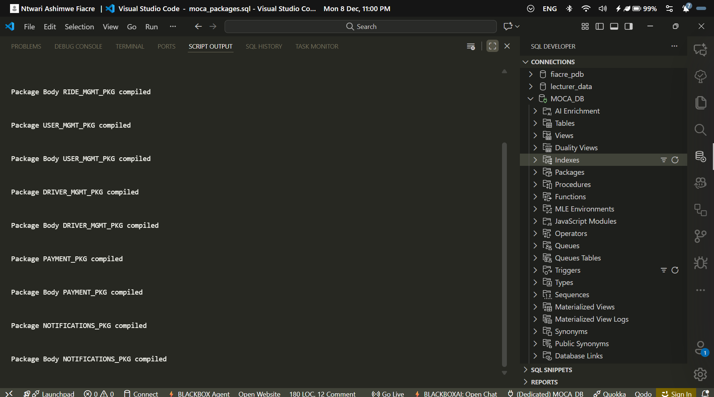
- Functions compiled and validated
  - Evidence: 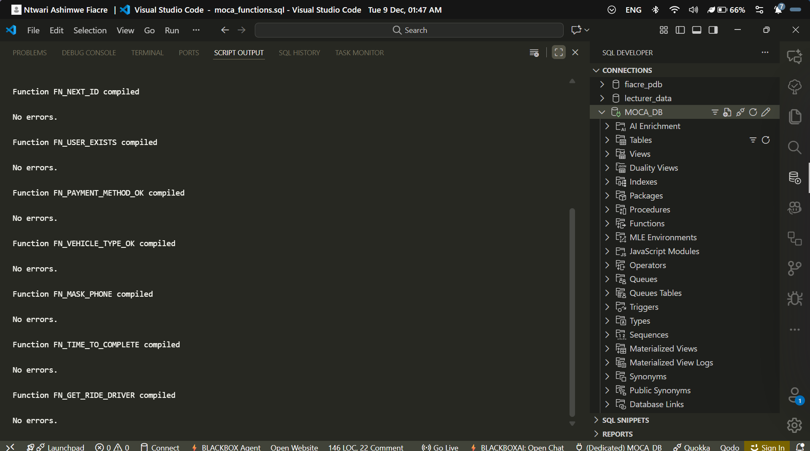
- Procedures compiled and ready for invocation
  - Evidence: 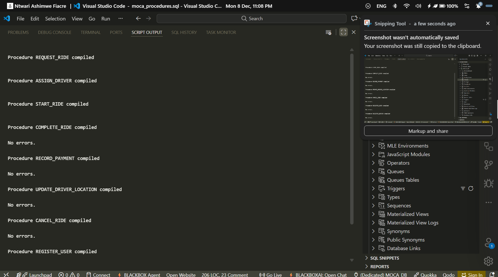
- Triggers compiled to enforce integrity and auditing
  - Evidence: 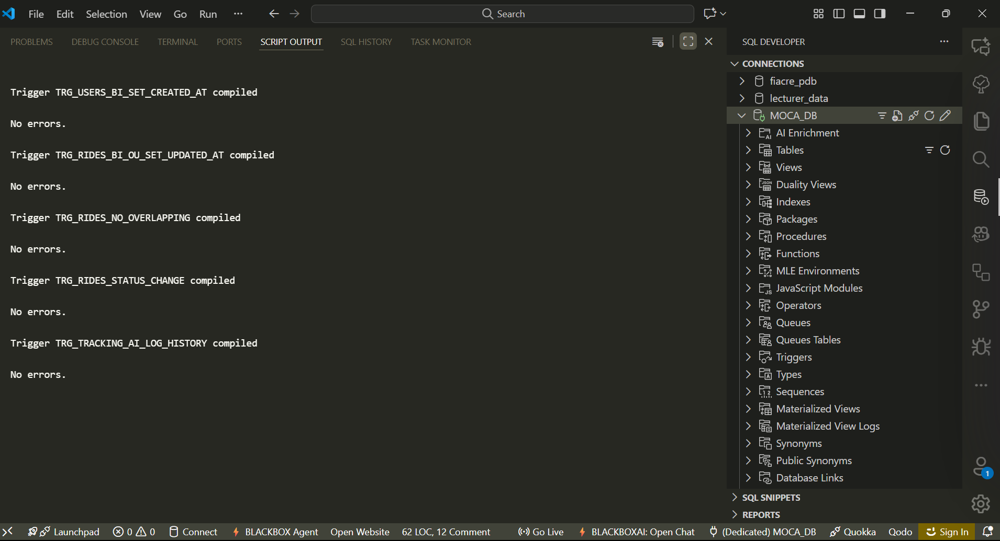
- Cursors available as per design
  - Evidence: 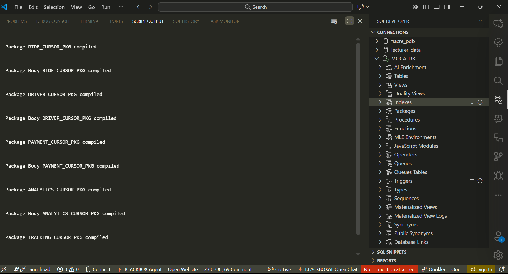

## 3. Data Manipulation and DML Flow
- Row insert scenarios executed across core tables
  - Evidence: 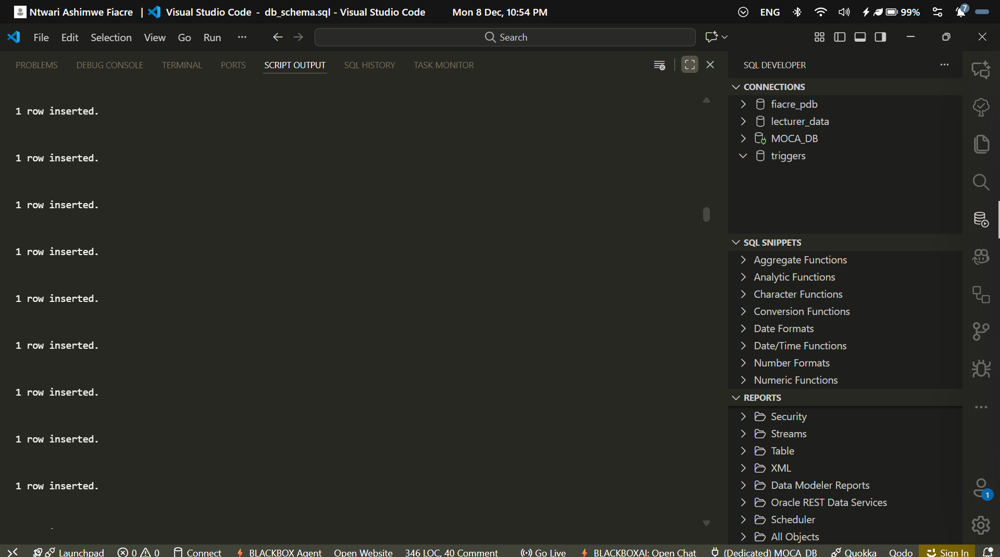
  - Evidence: 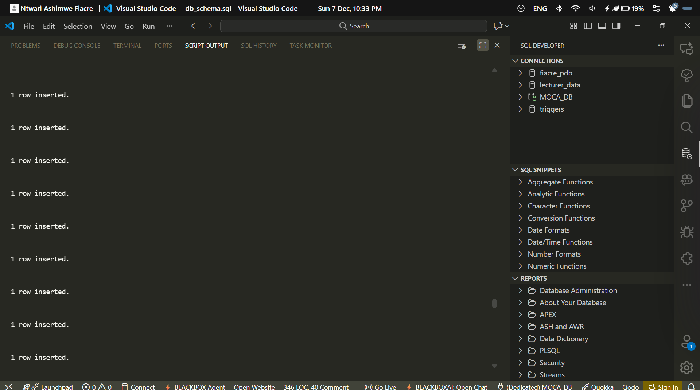
  - Evidence: 
  - Evidence: 
  - Evidence: 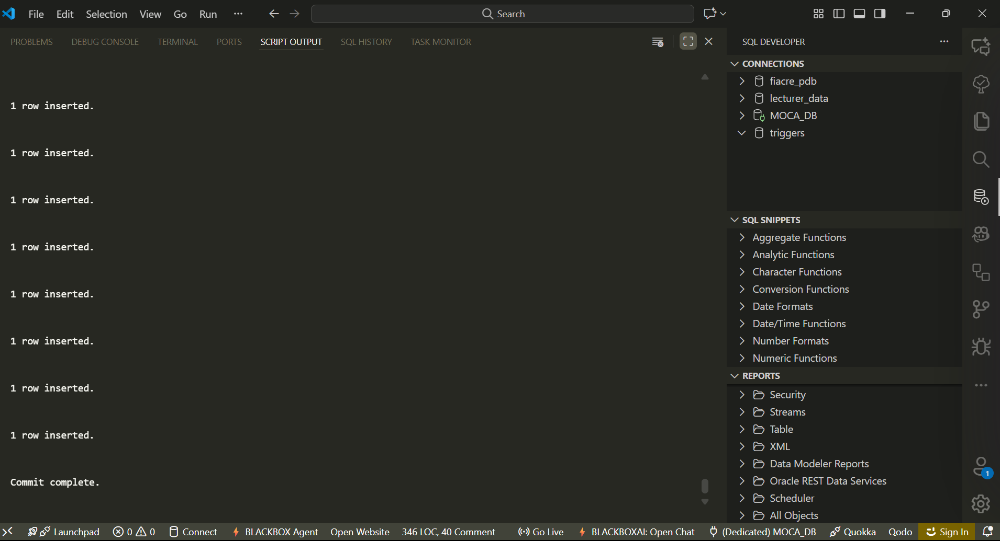
- Driver and log sequencing validated
  - Evidence: 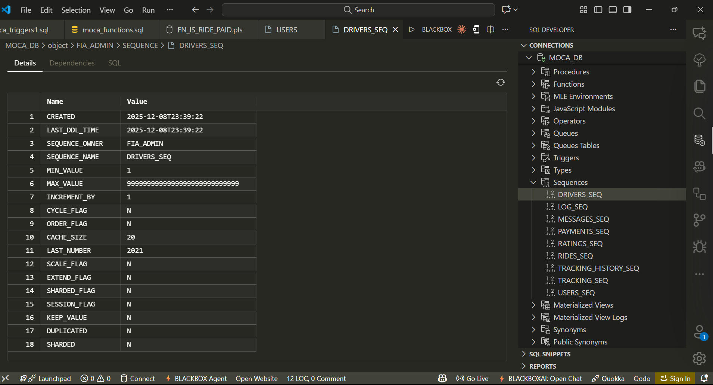
  - Evidence: 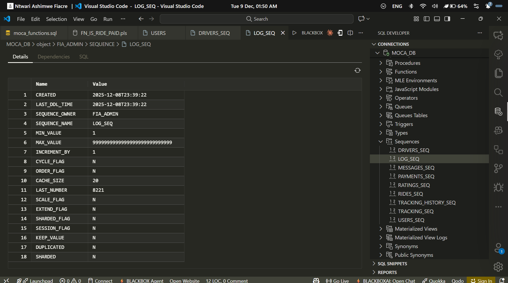

## 4. Environment and Monitoring (Supplementary)
While the primary scope was object validation and DML, we also captured supporting evidence in the monitoring area for memory/SGA to ensure a healthy baseline during tests (see screenshots/monitoring for details). This helped confirm stability during compilation and DML bursts.

## 5. Results
- All targeted objects compiled successfully with no blocking errors.
- DML operations functioned as expected, with sequences and triggers behaving deterministically.
- Artefacts provide traceability from design to execution.

## 6. Early Lessons and Experience
- Establish a deterministic order of object deployment: sequences -> tables -> indexes -> packages/functions/procedures -> triggers. This eliminated dependency churn during compilation.
- Use dedicated sequences for logs and drivers to simplify debugging of event ordering during inserts.
- Capture screenshots as part of the test definition. Having visual evidence accelerated reviews and reduced back-and-forth.
- Keep compilation output clean by failing fast on warnings treated as errors in CI, ensuring repeatable builds.

## 7. TEST CASES
- Add unit tests for functions and procedures with expected inputs/outputs.
- Track performance baselines before and after index changes to catch regressions early.

Evidence: 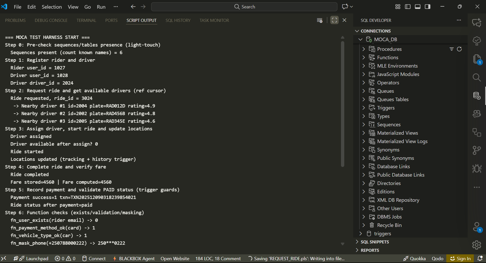
Evidence: 

---
 